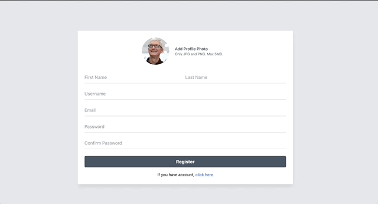

# RAT - voice messanger 

> Note: The primary objective of this project is to learning and experimentation with Go programming. Initially conceived without a concrete direction, the project has now pivoted towards a more focused idea: developing a voice chat application. This shift is part of an effort to streamline the project's scope and avoid overengineering, allowing for a more targeted learning experience.

## Overview

RAT, short for "Rate All Things," initially began without a fully fleshed-out concept. However, it has since evolved into a more thoughtfully designed project. As development progresses, we aim to transform RAT into a robust voice messaging platform. This platform will incorporate various features including user authentication, real-time communication through websockets, and a middleware architecture to ensure scalability and security.

